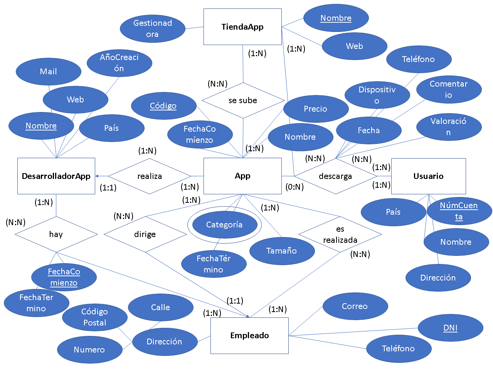

# MODULO 1: BASE DE DATOS SQL

Proyecto final del primer modulo dentro del master “Big Data & Data Science” impartida por la Universidad Complutense De Madrid, en 
donde se pone en practica lo aprendido durante el modulo a través de la implementación de una a bases de datos que le permita a las 
"Tiendas de Aplicaciones" guardar información valiosa

